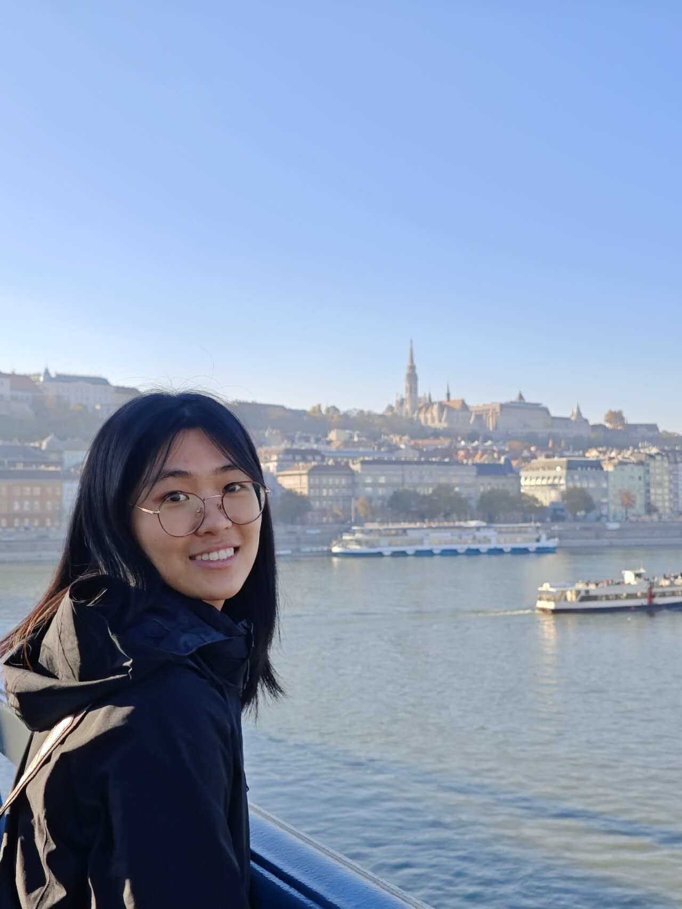

# Shuaiyi Li 李帅谊

  <a href="#ee"> ee </a>
  &emsp;&emsp;&emsp;
  <a href="#about-me"> 🌙 About Me</a>
  &emsp;&emsp;&emsp;
  <a href="#news">News</a>
  &emsp;&emsp;&emsp;
  <a href="#education">Education</a>
  &emsp;&emsp;&emsp;
  <a href="#research">Research</a>
  &emsp;&emsp;&emsp;
  <a href="#blogs">Blogs</a>

## About Me <a name="me" style="display: none;">a</a>

<a name="ee" style="display: none;">ee</a>

I am currently a final-year Master student at [Shanghai Jiao Tong University](https://sjtu.edu.cn/), supervised by [Prof. Xiang Yin](https://xiangyin.sjtu.edu.cn/), major in automation. Before that, I received my B.S. degree in SJTU, also major in automation.

✉️Email: lishuaiyi@sjtu.edu.cn

🔗[Github](https://github.com/LiShuaiyi) 

[Back](#shuaiyi-li-李帅谊)

## 🔥 News <a name="news" style="display: none;">a</a>

- 2023.03 🎉🎉Our non-blocking controller synthesis paper got accepted by IFAC'23.

[Back](#shuaiyi-li-李帅谊)

## 📖 Education Experience <a name="education" style="display: none;">a</a>

*Educations*:

- 2021.09 - 2024.03(*expected*), M.S. in Shanghai Jiao Tong University, Automation

    *GPA 3.84/4.0; Ranking 8/122*

    *TOEFL 112/120; GRE to be taken*

- 2017.09 - 2021.06, B.S. in Shanghai Jiao Tong University, Automation

    *Grade 88.0/100; Ranking 15/104*

- 2012.09-2017.07, junior and senior high school all together in Gifted Class, North East YuCai School (NEYC) 

*Scholarships and Awards*:

- Shanghai Jiao Tong University First Class Scholarship, 2021-2023

[Back](#shuaiyi-li-李帅谊)

## 📝 Research Experience <a name="research" style="display: none;">a</a>

### [SJTU Cyber-physical System Lab](https://xiangyin.sjtu.edu.cn/group.html), 2021.09 – Present

*Mainly focus*: High-level liner temporal logic task planning problem for intelligent agent under partial observation, including

- Non-blocking controller synthesis 

- Active-sensing task planning algorithm design

*Publications*: 

[1] **Shuaiyi Li**, S. Li and X. Yin. “Synthesis of non-blocking controllers for linear temporal logic tasks under partial observations.” in 22nd IFAC World Congress, accepted, 2023. [[PDF]](https://xiangyin.sjtu.edu.cn/Paper/23IFAC-nb.pdf) 

[2] **Shuaiyi Li**, M. Wei, S. Li and X. Yin. “Temporal Logic Task Planning for Autonomous Systems with
Active Acquisition of Information.” in IEEE Trans. Intelligent Vehicles (T-IV), under review, 2023.

### [SJTU Institute of Image Processing and Pattern Recognition](http://www.pami.sjtu.edu.cn/En/Home), 2019.08-2021.06

Mainly focus: Adversarial attack and medical image processing, including 

-  Attack and data enhancement of colonoscopy polyp detector

- Analyze of chromosome karyotype image

*Publications*: 

[1] Fan He, Sizhe Chen, **Shuaiyi Li**, et al. “Colonoscopic image synthesis for polyp detector enhancement via gan and adversarial training.” in IEEE 18th International Symposium on Biomedical Imaging (ISBI), 2021. [[PDF]](https://ieeexplore.ieee.org/abstract/document/9434050)

[Back](#shuaiyi-li-李帅谊)

## 🌴 Blogs <a name="blogs" style="display: none;">a</a>

This region is in construction...

👷👷‍♀️👷🏽🚧🚧🚧🚧🚧🚧🚧🚧🚧🚧

[Back](#shuaiyi-li-李帅谊)
